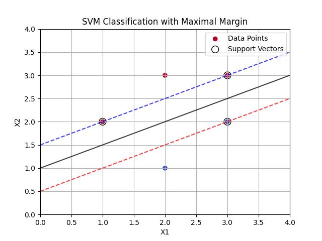
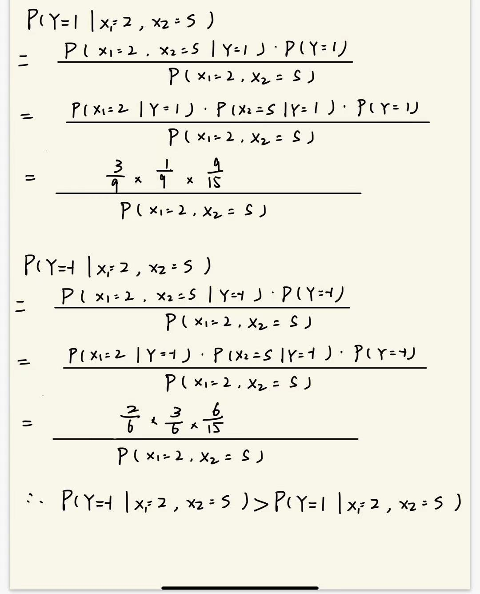

# ML Homework
## 汪珉凯       3220100975

### 1
首先我用python遍了一个简单的SVM程序来解决这个问题，代码如下：  
```
import numpy as np
import matplotlib.pyplot as plt
from sklearn import svm

# 定义正例和负例数据
X = np.array([[1, 2], [2, 3], [3, 3], [2, 1], [3, 2]])
y = np.array([1, 1, 1, -1, -1])

# 使用SVM进行训练
clf = svm.SVC(kernel='linear', C=5)
clf.fit(X, y)

# 获取超平面参数
w = clf.coef_[0]
b = clf.intercept_[0]

print('w:', w)
print('b:', b)

# 计算支持向量
support_vectors = clf.support_vectors_

# 绘制数据点
plt.scatter(X[:, 0], X[:, 1], c=y, cmap='coolwarm', marker='o', label='Data Points')

# 绘制支持向量
plt.scatter(support_vectors[:, 0], support_vectors[:, 1], s=100, facecolors='none', edgecolors='black', label='Support Vectors')

# 绘制决策超平面
ax = plt.gca()
xx, yy = np.meshgrid(np.linspace(0, 4, 30), np.linspace(0, 4, 30))
Z = clf.decision_function(np.c_[xx.ravel(), yy.ravel()])
Z = Z.reshape(xx.shape)

# 绘制决策边界和间隔边界
plt.contour(xx, yy, Z, levels=[-1, 0, 1], alpha=0.75, colors=['red', 'black', 'blue'], linestyles=['--', '-', '--'])

# 添加标签和标题
plt.xlabel('X1')
plt.ylabel('X2')
plt.title('SVM Classification with Maximal Margin')
plt.legend()
plt.grid(True)
plt.show()

# save the plot
plt.savefig('SVM.png')
```   
得到结果：  
最大间隔超平面的`w=[-1 , 2] , b=-2`，因此对应的分类决策函数为`f(x)=[-1,2]x-2`。具体的图片如下所示：  
 
其中黑色实线是超平面，红、蓝两色是正反例的间隔边界，而被圈出的原点就是支持向量。  

### 2
##### 2.1. 逻辑与（AND）运算

逻辑与运算的真值表如下：

| 输入A | 输入B | 输出Y (A AND B) |
|-------|-------|-----------------|
|   0   |   0   |        0        |
|   0   |   1   |        0        |
|   1   |   0   |        0        |
|   1   |   1   |        1        |

为了实现该运算，设置感知机的权重和偏置：

- 权重 \( W_1 = 1 \), \( W_2 = 1 \)
- 偏置 \( b = -1.5 \)

感知机的输出函数是阶跃函数：

\[
f(x) =
\begin{cases}
1 & \text{if } x \geq 0 \\
0 & \text{if } x < 0
\end{cases}
\]

测试每种输入组合：

- 输入 (0, 0): \( f(0 \times 0 + 0 \times 0 - 1.5) = f(-1.5) = 0 \)
- 输入 (0, 1): \( f(0 \times 0 + 1 \times 1 - 1.5) = f(-0.5) = 0 \)
- 输入 (1, 0): \( f(1 \times 1 + 0 \times 0 - 1.5) = f(-0.5) = 0 \)
- 输入 (1, 1): \( f(1 \times 1 + 1 \times 1 - 1.5) = f(0.5) = 1 \)

因此，感知机可以正确实现逻辑与运算。

##### 2.2. 逻辑或（OR）运算

逻辑或运算的真值表如下：

| 输入A | 输入B | 输出Y (A OR B) |
|-------|-------|----------------|
|   0   |   0   |        0       |
|   0   |   1   |        1       |
|   1   |   0   |        1       |
|   1   |   1   |        1       |

为实现该运算，设置感知机的权重和偏置：

- 权重 \( W_1 = 1 \), \( W_2 = 1 \)
- 偏置 \( b = -0.5 \)

测试每种输入组合：

- 输入 (0, 0): \( f(0 \times 0 + 0 \times 0 - 0.5) = f(-0.5) = 0 \)
- 输入 (0, 1): \( f(0 \times 0 + 1 \times 1 - 0.5) = f(0.5) = 1 \)
- 输入 (1, 0): \( f(1 \times 1 + 0 \times 0 - 0.5) = f(0.5) = 1 \)
- 输入 (1, 1): \( f(1 \times 1 + 1 \times 1 - 0.5) = f(1.5) = 1 \)

因此，感知机可以正确实现逻辑或运算。

##### 2.3. 逻辑非（NOT）运算

逻辑非运算的真值表如下：

| 输入A | 输出Y (NOT A) |
|-------|---------------|
|   0   |       1       |
|   1   |       0       |

设置感知机为单输入模型：

- 权重 \( W_1 = -1 \)
- 偏置 \( b = 0.5 \)

测试每种输入组合：

- 输入 (0): \( f(-1 \times 0 + 0.5) = f(0.5) = 1 \)
- 输入 (1): \( f(-1 \times 1 + 0.5) = f(-0.5) = 0 \)

因此，感知机可以正确实现逻辑非运算。

##### 2.4. 单层感知机不能表示异或（XOR）运算

异或（XOR）运算的真值表如下：

| 输入A | 输入B | 输出Y (A XOR B) |
|-------|-------|-----------------|
|   0   |   0   |        0        |
|   0   |   1   |        1        |
|   1   |   0   |        1        |
|   1   |   1   |        0        |

异或运算是**非线性可分**的，意味着无法用一条直线将输入输出组合分类。对于“与”、“或”运算，输出是线性可分的，而异或运算无法通过单层感知机的线性决策边界来表示。

例如，输出为1的组合是（0, 1）和（1, 0），而输出为0的组合是（0, 0）和（1, 1）。这些点在平面上无法用一条直线分割开来。

因此，单层感知机不能表示异或运算。

##### 2.5.设计多层感知机实现异或运算

1. 网络结构
- **输入层**：2 个神经元（对应输入 \( A \) 和 \( B \)）。
- **隐藏层**：2 个神经元，使用非线性激活函数（如 Sigmoid）。
- **输出层**：1 个神经元，输出 \( Y \) 作为 XOR 运算结果。


2. 前向传播过程
**隐藏层输出**：
   - \( h_1 = (W_1 \cdot A + W_2 \cdot B + b_1) \)
   - \( h_2 = (W_3 \cdot A + W_4 \cdot B + b_2) \)
**输出层**：
   - \( Y = (W_5 \cdot h_1 + W_6 \cdot h_2 + b_3) \)
   W1 = (1,-1)  ,   b1 = -0.5
   W2 = (-1,1)  ,   b2 = -0.5
   W3 = (1, 1)  ,   b3 = -0.5
### 3
##### 3.1核化线性降维与流形学习的联系
1.都是用来处理数据降维的问题。  
2.核化线性降维中的部分方法（如KPCA）和流形学习都能用来处理高维数据中的非线性结构。  
3.算法框架相似，核化线性降维会利用核矩阵表示数据点之间的关系，流形学习中也常构建邻接矩阵或相似度矩阵。  
4.两者在降维过程中都尽可能保持原有数据的信息。  
##### 3.2核化线性降维与流形学习的区别
1.核线性降维（比如KPCA）是一种全局的优化方法，而流形学习则采用局部优化策略。  
2.基本假设不同。核化线性降维假设数据通过非线性映射映射到高维空间后，能在高维空间中用线性方法（如PCA）进行降维；流形学习假设数据本质上位于低维流形上，降维方法侧重于保留数据的局部几何结构。  
3.降维方法不同。核化线性降维通过核技巧将数据映射到高维空间后进行PCA，而流形学习通过邻接矩阵和图算法（如Isomap、LLE）来保留局部结构。  

### 4
  
可以看到，训练得到的朴素贝叶斯分类器将该数据的标签定为-1。